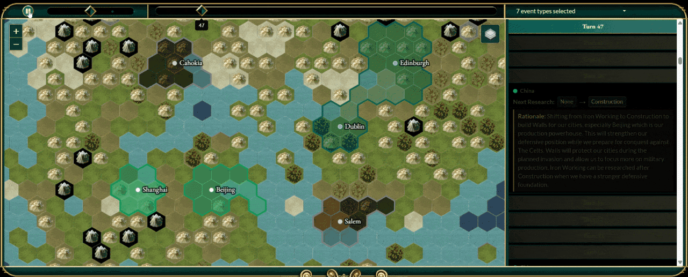

# Civilization V Replay Viewer for Community Patch/Vox Populi

This web-based replay viewer allows you to watch your Civilization V replays. Watch empires rise and fall, see borders shift over centuries, and relive your most epic games. The viewer is specifically designed for the [Community Patch / Vox Populi](https://github.com/LoneGazebo/Community-Patch-DLL) mod and may not work correctly with vanilla replay files.

Designed to work with the [Vox Deorum project](https://github.com/CIVITAS-John/vox-deorum), a modmod that enables LLMs to play Vox Populi with you or with themselves.



## How to Use

Visit the viewer at: https://civitas-john.github.io/vox-deorum-replay/

In those examples, Player 0 is an LLM. You can see how they play and reason throughout the game.
- [Example save 1](https://civitas-john.github.io/vox-deorum-replay/?file=https://civitas-john.github.io/vox-deorum-replay/examples/1.Civ5Replay)
- [Example save 2](https://civitas-john.github.io/vox-deorum-replay/?file=https://civitas-john.github.io/vox-deorum-replay/examples/2.Civ5Replay)
- [Example save 3](https://civitas-john.github.io/vox-deorum-replay/?file=https://civitas-john.github.io/vox-deorum-replay/examples/3.Civ5Replay)

### Option 1: Drag and Drop
Simply drag your `.Civ5Replay` file from your computer and drop it onto the webpage. The replay will load automatically and you can use the playback controls or keyboard shortcuts to navigate through the game.

### Option 2: Direct Link
Share replays with others by linking directly to a hosted replay file. Add the `file` parameter with the full URL to your replay:
```
https://civitas-john.github.io/vox-deorum-replay/?file=https://civitas-john.github.io/vox-deorum-replay/examples/1.Civ5Replay
```
The viewer keeps the address bar in sync while you explore, so copying the URL at any point shares the exact view. These parameters are available:

Parameter   | Meaning
------------| --------
`file`       | Full URL of a hosted `.Civ5Replay` or `.Civ5Save` file to load on open
`turn`       | Starting turn, kept in sync as you move through the timeline
`view`       | Which destination is active: `map` (default) or `events`
`player0` … `playerN` | Annotation for a civilization, see below

### Annotating Civilizations

When sharing a game between LLMs or specific players, you can label each civilization through the address bar. Player numbering starts at zero, so `player0` annotates the first civilization in the file, `player1` the second, and so on:
```
https://civitas-john.github.io/vox-deorum-replay/?file=https://civitas-john.github.io/vox-deorum-replay/examples/1.Civ5Replay&player0=Qwen&player1=GLM
```
The annotations appear in the header ("Rome: Qwen · Egypt: GLM") and next to civilization names in the event log.

The project is built on Alex Webb's [civ5replayer](https://github.com/aiwebb/civ5replay).

### Where to Find Replay Files?

Civilization V (Vox Populi) replay files are saved with the `.Civ5Replay` extension. You can find them in:

**Windows:**
```
Documents\My Games\Sid Meier's Civilization 5\Replays\
```

**Mac:**
```
~/Documents/Aspyr/Sid Meier's Civilization 5/Replays/
```

**Linux:**
```
~/.local/share/Aspyr-Media/Sid Meier's Civilization 5/Replays/
```

Note: Replay files are only generated if you have "Save Replays" enabled in the game options.

### Keyboard Shortcuts

Key            | Action
-------------- | ------------
`space`        | Play/pause
`1` - `5`      | Set speed
`←`, `→`       | Back/forward one turn
`↑`, `↓`       | Back/forward ten turns
`pgup`, `home` | Jump to first turn
`pgdn`, `end`  | Jump to last turn
`+`, `-`       | Zoom in/out


## Helping Us
All pull requests are welcome. In particular, we need your help to:
- Visualize all VP5 features (e.g., Oasis) and Natural Wonders.
- Create better/higher-quality textures.
- Visualize replay DATA - e.g., gold output per turn for each player.
- Adding tooltips on the map and on individual events.

I am planning to work on some of these, when I get some more time :)

## License

Author: John Chen (with assistance from Claude Code).
Lecturer, University of Arizona, College of Information Science
MIT License (as the project forked from [civ5replayer](https://github.com/aiwebb/civ5replay))

## Acknowledgement
- Alex Webb - [civ5replayer](https://github.com/aiwebb/civ5replay)
- Kristoffer Berdal - [flexd/replay_parser](https://github.com/flexd/replay_parser)
- Danny Fisher - [CivFanatics thread](http://forums.civfanatics.com/showthread.php?t=388160)
- Vox Populi Community - [Vox Populi](https://github.com/LoneGazebo/Community-Patch-DLL)