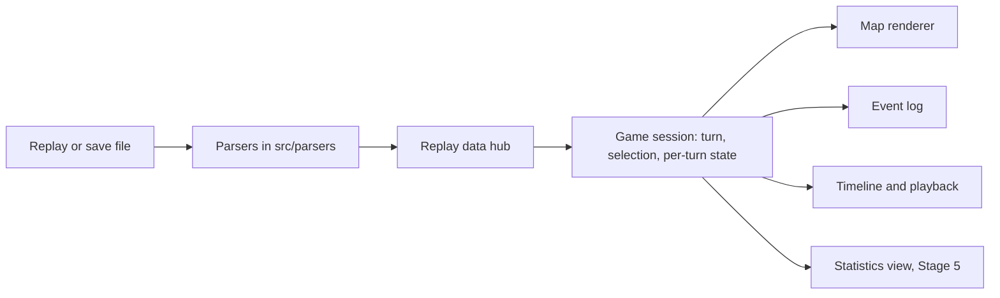

# Frontend redesign plan

Status: draft for revision. This document keeps the stages, mockups, and open decisions in one place. Implementation happens one stage at a time, and each stage ends with a review of the replay and save examples on desktop and phone before the next one starts.

## Overall direction

Make the map the center of the experience, with a clear timeline, useful inspection, and a separate space for statistics. Keep some Civilization character through restrained colors and typography, while giving controls and content room to breathe.

The current viewer combines a map, playback controls, and an event log. It opens replay and save files and already reads 29 statistics datasets per civilization. Save files also carry river edges, which are not yet drawn. Everything richer (plot ownership from the save, city details, economy, diplomacy) needs parser work first, and part of that work is finding out whether the save holds any history for it or only the final snapshot.

The application has three destinations: **Map**, **Events**, and **Statistics**. On larger screens, events and inspection sit beside the map. On phones, each destination gets the full content area, and map details open in a bottom sheet. Changing destinations preserves the selected turn and civilization.

### Two kinds of data

- **Replay history** is known at every turn: the event log and the datasets, which both file types carry, plus terrain and rivers. Terrain and rivers are fixed when the map is generated, so they are valid at every turn even though only save files store the rivers.
- **Saved snapshot** is known only at the turn of the loaded save: plot ownership, improvements, resources, routes, city details, and anything else read from the save's game state. Whether any of it comes with history is what Stage 3 finds out.

Snapshot details appear only while the timeline sits on the save's last turn and step aside with a short note when it moves back. This keeps a single timeline and needs no separate mode. A replay file never has snapshot data and stays fully useful without it. When the save is a finished game, the snapshot is the end-game position. When it is not, the interface says "Snapshot at turn ..." and never implies that the game ended.

### Technology decisions

- **Plain TypeScript and plain CSS, no framework.** jQuery, Bootstrap 3, bootstrap-slider, and selectpicker leave in Stage 2 together with the layout they hold up.
- **Leaflet stays** until Stage 4 produces a measured reason to replace it.
- **Vitest covers core logic**, meaning the session model, parsers, and statistics selectors. The UI is reviewed by hand on the examples. Each stage lists its minimal coverage.
- **Shared links carry more state.** The `file` and `turn` parameters grow to include the destination, and the chosen measure, so a link lands where the sender was looking.

## Stage 1: Refactor the core into a session model

Status: implemented. The session model lives in `src/replay/session.ts`, the compact ownership timeline in `src/replay/ownership.ts`, and the map, the event log, and the timeline all follow the session through subscriptions. Turn-state folding no longer happens in the renderer, and the datasets are typed as one series of turn and value pairs per civilization.

**Goal:** give Stage 2 a clean baseline. The UI stays as it is.

Today the turn-by-turn ownership of tiles is computed inside the map class in `src/map/replay-map.ts`, which also keeps a full copy of the tile state for every turn. That logic moves into a core session model that owns the loaded game, the current turn, the selection (civilization, tile, or city), and the per-turn state derived from events. The map, event log, and timeline become subscribers of the session instead of calling each other.



Work in this stage:

- Move per-turn ownership out of the renderer and store it compactly, as a list of ownership changes per tile rather than a full copy of the map per turn. Large maps on phones depend on this.
- Give every piece of data a kind, history or snapshot, at the Replay level so later views never guess.
- Fix the datasets typing in `src/replay/replay.ts`: the stored shape is one series of turn and value pairs per civilization for each dataset, and the declared type says something else.
- Keep file opening, drag and drop, shared links, starting turn links, playback shortcuts, event filters, and event-to-map interactions working. The viewer, the Replay hub, the parsers, the event and strategy parsers, the text formatter, and the civilization colors stay.

**Tests:** per-turn ownership from the session model checked against the example replays for a founded city, a tile claim, a city transfer, and a razing. The existing parser tests keep passing.

**Ready to move on when:** the examples still work and the map, events, and timeline are driven by the session rather than by each other.

## Stage 2: Build a responsive layout in plain CSS

**Goal:** make opening and exploring a game comfortable on desktop, tablet, and phone.

Rebuild `index.html` and `assets/main.css` around a compact header, a persistent one-row timeline, and an events side panel beside the map on larger screens. On phones, the three destinations become tabs that take the full content area, and map details open in a bottom sheet. Use native controls where they fit (a range input for the timeline, a details element for filters) and small custom ones where they do not. Add an obvious Open file action, a welcoming empty state, and visible loading and error feedback in place of the current alert dialogs.

Desktop layout:

```text
+-----------------------------------------------------------------------------+
| Vox Deorum Replay    Game 4 · Standard · Small               [Open] [Stats] |
+-----------------------------------------------------+-----------------------+
| [Layers v]                                          | Events     [7 types v]|
|                                                     |-----------------------|
|                                                     |                       |
|                        MAP                          | T180  Rome founded    |
|                                                     |       Antium          |
|                                                     | T180  Egypt claimed   |
|                                                     |       3 tiles         |
|                                                     | T179  Rome adopted    |
|                                            [+] [-]  |       Tradition       |
+-----------------------------------------------------+-----------------------+
| [|<] [<] [ Play ] [>]   o============o-----------------  Turn 180 / 320  1x |
+-----------------------------------------------------------------------------+
```

Phone layout, portrait:

```text
+-------------------------------+
| Vox Deorum Replay      [Open] |
| [ Map ] [Events] [Statistics] |
+-------------------------------+
| [Layers]                      |
|                               |
|                               |
|              MAP              |
|                               |
|                               |
|                        [+][-] |
+-------------------------------+
| [<] [Play] [>]  o====o--- 180 |
+-------------------------------+
```

The play button switches between Play and Pause. Tapping the turn number opens a small popover with a go-to field and the speed choice, so the timeline stays one row. On phones, the destination tabs give Map, Events, and Statistics the full content area. On larger screens, Events stays in the side panel beside the map, and the Statistics button in the header opens the statistics view in place of the map. On tablets and in landscape, the side panel shows only while enough map space remains. Resizing preserves the place the user is exploring.

Empty state, shown before a file is loaded and reachable again from Open file:

```text
+------------------------------------------------+
|               Vox Deorum Replay                |
|                                                |
|                [Open file icon]                |
|      Drop a .Civ5Replay or .Civ5Save here      |
|                                                |
|  --------------------------------------------  |
|  [Game 1] [Game 2] [Game 3] [Game 4] [Game 5]  |
|                                                |
+------------------------------------------------+
```

The examples are the bundled games; where a save is bundled as well, the button offers both files. Show a loading indicator while we process the save, including from the URL.

Support touch panning and zooming, large tap targets, keyboard navigation, visible focus, and labels that do not rely on color alone. Essential information is available by tap or selection rather than hover.

**Tests:** the bundle builds and the existing suite passes. Layout is reviewed by hand at phone, tablet, and desktop widths.

**Ready to move on when:** a user can open a file, navigate turns, filter events, and inspect the map on a narrow phone screen without page-wide horizontal scrolling.

**Decision to revisit:** the amount of Civilization ornamentation. The proposed default is a quiet, modern frame around a visually rich map.

## Stage 3: Explore and expand the parsers

**Goal:** know what the files can tell us before designing map layers and statistics around guesses.

The save parser in `src/parsers/save-parser.ts` currently stops reading each plot record after terrain, feature, and river ids, even though `docs/save-format.md` documents where owner, improvement, resource, and route sit. The map header's wrap flags and the game prelude's winning turn are read and discarded. The per-player sections holding cities, units, and diplomacy are not read at all. Datasets from saves are attributed to civilizations by heuristics whose diagnostics never reach the interface.

Work in this stage:

- Expose the map wrap flags and the remaining map header fields.
- Read plot owner, improvement, resource, route, and any other cheap per-plot field. Compare the plot owner with the event-derived ownership at the save turn; agreement validates both.
- Expose the winning turn and the victory information from the header, and define what counts as a reliable result.
- Survey the per-player sections: what a city record carries (population, buildings, founding turn), what the diplomacy block holds, and which fields, if any, are per-turn history rather than current values. Record the findings in `docs/save-format.md`.
- Surface the save dataset diagnostics (damaged and unattached clusters) so statistics can label uncertain series.
- Produce a data inventory: every field of interest marked history, snapshot, or unavailable, with the parser cost of reading it.

**Tests:** new fields are checked against replay ground truth where one exists (plot owner against events at the final turn) and against invariants where none does (river edge pairing, city count against founded and razed events).

**Ready to move on when:** the data inventory is written and Stages 4 to 6 can name their layers and measures from it.

**Decision to revisit:** which per-player fields earn the decode effort. A field with history is worth more than a richer snapshot.

## Stage 4: Improve the 2D map renderer and add rivers

**Goal:** a clearer, smoother map that can carry more detail later.

Measure playback frame time and memory on the largest example on a phone first, then decide whether Leaflet's canvas tiles stay or a single canvas replaces them. Keep the map two-dimensional.

Draw rivers along the correct hex edges at every turn when the file supplies them. Each hex draws its own river edges, so continuity across the horizontal seam needs no special case, and the wrap flag from Stage 3 allows optional wrapped panning later. Make junctions and coast connections readable and keep rivers distinguishable from borders. For replay files the layer list explains "Rivers are available from save files."

Establish one visual treatment for terrain, hills, mountains, forests, natural wonders, cities, and borders. At a distant zoom, emphasize geography and territory. Reveal labels and detail as the user zooms in.

```text
+-----------------------------------------------------+
| [Layers v]                                          |
| +------------------+                                |
| | [x] Terrain      |      ^^  ^                     |
| | [x] Rivers       |     ^  ^  \                    |
| | [x] Borders      |          ~~\_                  |
| | [x] Cities       |     :::::   ~~\   * Antium     |
| | [ ] Hex grid     |     :Rome:     ~~\___          |
| | [ ] Resources    |     :::::        ~~~~~ coast   |
| +------------------+                                |
| ^ mountain  ~ river  * city  ::: territory          |
+-----------------------------------------------------+
```

The sketch shows visual priority only. The real map follows hex edges. Layers that Stage 3 marks as snapshot only, such as resources, stay off by default and follow the snapshot rule from the overall direction.

**Tests:** river edge geometry for the six directions and the seam, checked in Vitest against the example save.

**Ready to move on when:** rivers are continuous and correctly placed, borders and cities remain legible, and the largest example is comfortable to explore on desktop and phone.

**Decision to revisit:** terrain style, textured tiles or a cleaner illustrated look. Compare small visual samples before committing to an asset refresh.

## Stage 5: Introduce statistics

**Goal:** make the available numbers useful now, and leave room for richer results later.

The 29 datasets already parsed and tested come first. Confirm each one's name, unit, and turn coverage before presenting it. Offer a summary at the last recorded turn, a comparison table, and one chart of a chosen measure over time. Save-derived series carry the attribution diagnostics from Stage 3 and are labeled when uncertain.

```text
+-----------------------------------------------------------------------------+
| Vox Deorum Replay    Game 4 · Standard · Small               [Open] [Stats] |
| Turn 320                            [ Overview ]  [ Trends ]  [ Compare ]   |
+-----------------------------------------------------------------------------+
| Civilization    Score   Cities   Population   Gold    Techs                 |
| Rome             1240       9         71      1820       48                 |
| Egypt             980       7         55       640       44                 |
| Songhai           610       4         30       n/a       39   incomplete    |
|                                                                             |
| Measure [Score v]            Civilizations [x] Rome  [x] Egypt  [ ] Songhai |
|                                                                             |
| 1240 |                                           ______ Rome                |
|      |                                __________/                           |
|      |                     __________/         .......... Egypt             |
|  600 |           _________/      ..............                             |
|      |   _______/    ............                                           |
|    0 +------------------------------------------------------------ Turn     |
|      0         80        160       240       320                            |
|                                            [View turn 240 on map]           |
+-----------------------------------------------------------------------------+
```

Values in this mockup are illustrative. On phones the table becomes a compact list and the chart stacks below it. Readable values sit next to every chart so comparison never depends on reading lines or colors alone. Unavailable data is shown as unavailable and never as zero, incomplete histories are labeled, and a winner or victory type appears only when Stage 3 established a reliable result.

Parser-dependent measures follow as separate increments. Candidates include economy, science, culture, military strength, city development, and diplomacy. Choose the questions users want answered first, then take the parser work for each from the Stage 3 inventory. A snapshot-only value can support a final comparison without supporting a chart.

**Tests:** statistics selectors (value at turn, series for a civilization, availability) checked against the example datasets.

**Ready to move on when:** users can compare civilizations using the existing datasets and jump from a chart turn to the map.

**Decision to revisit:** which two or three end-game questions deserve the next parser work, for example "Who led in science?" or "How did each empire develop its cities?"

## Stage 6: Add richer map inspection

**Goal:** let users understand a position through the map, using the inventory from Stage 3.

Introduce tile and city inspection, and a compact legend. Begin with terrain, rivers, and event-derived city and ownership information, which work at every turn. Add snapshot fields such as resources, improvements, routes, and city population as separate layers that follow the snapshot rule.

Desktop, inspecting a city at the save's last turn:

```text
+-----------------------------------------------------+-----------------------+
| [Layers v]                                          | Antium           [x]  |
|                                                     |-----------------------|
|                    MAP                              | Rome, founded T112    |
|              selected city (*)                      |                       |
|                                                     | Grassland, hills      |
|                                                     | River on 2 edges      |
|                                                     |                       |
|                                                     | Snapshot at turn 320  |
|                                                     | Population 14         |
|                                                     | Wheat, farm, road     |
|                                                     |                       |
|                                                     | [Show city events]    |
+-----------------------------------------------------+-----------------------+
```

The side panel shows the event list until a tile or city is selected; the close control returns to the events. The same panel at turn 180 keeps the top block and replaces the snapshot block with one line: "Snapshot details are available at turn 320."

Phone, the same inspection as a bottom sheet:

```text
+-------------------------------+
|              MAP              |
|        selected city (*)      |
+-------------------------------+
| Antium                    [x] |
| Rome, founded T112            |
| Grassland, hills, river       |
| Snapshot at turn 320:         |
| Population 14, wheat, farm    |
| [Show city events]            |
+-------------------------------+
```

Selecting an event with a known location focuses the map. Inspecting a city can open its history in the Events panel. Optional overlays stay off until requested so the map stays readable.

**Tests:** the inspection selectors (tile and city at a coordinate, events for a city) checked against the example replays.

**Ready to move on when:** users can inspect a city or tile, see which turn its details describe, and move between inspection and events without losing context.

**Decision to revisit:** which snapshot layers are most useful. Units and detailed city views stay open until their data and visual value are clearer.

## How to revise and carry out this plan

Edit each stage and its mockups here as decisions settle. Keep this as the single design draft rather than splitting layouts and open questions into separate documents.

The order is core refactor, responsive layout, parser exploration, renderer and rivers, statistics, then richer inspection. The first statistics increment needs only Stages 1 and 2 and may run alongside Stage 3. Parser expansion must finish before the map layers and measures that depend on it, but it does not hold up the layout or the river rendering.

Before implementing each stage, settle its open design choices and narrow its first deliverable. Review the result on the replay and save examples on desktop and phone before starting the next stage.
